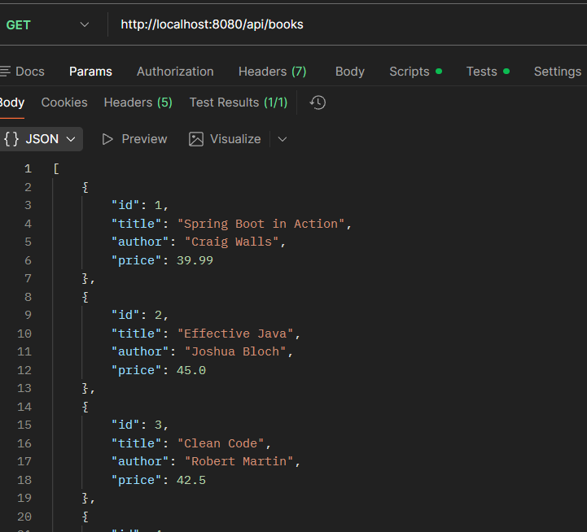
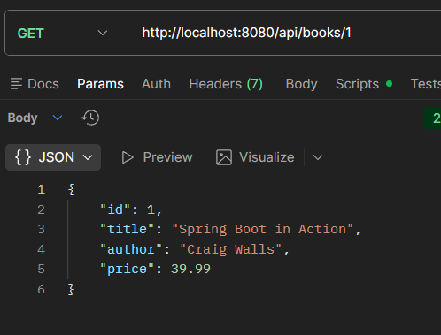
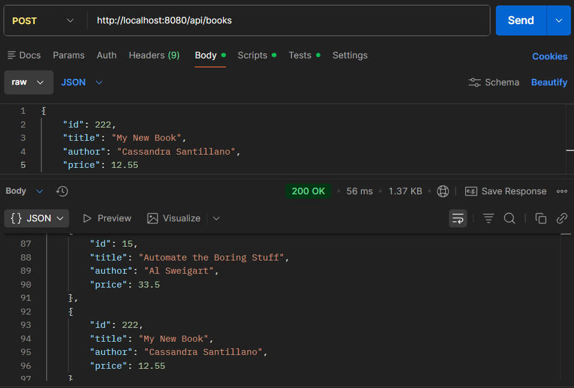
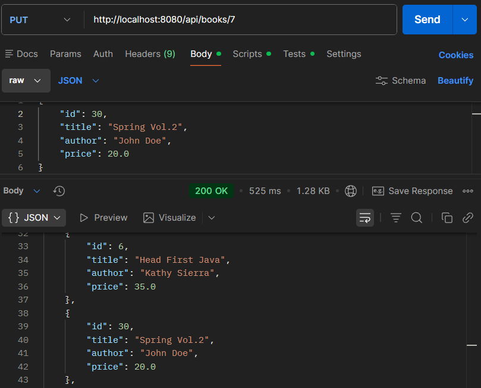
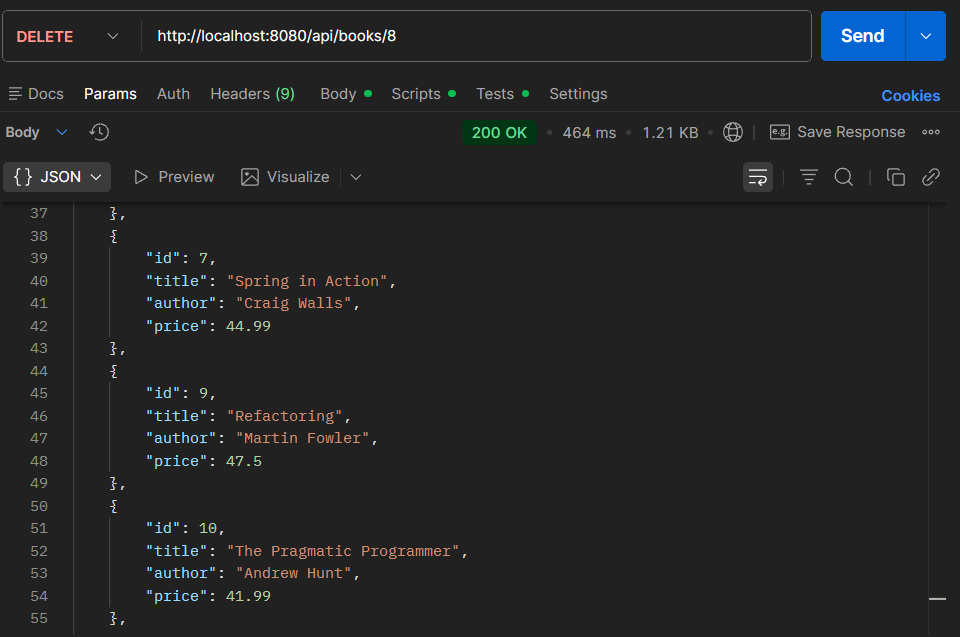
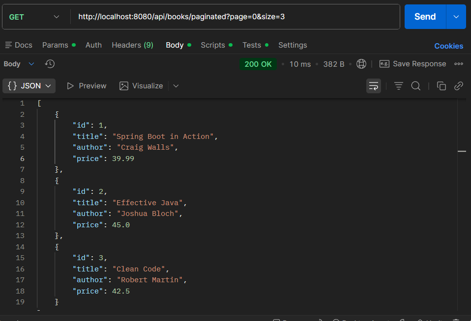
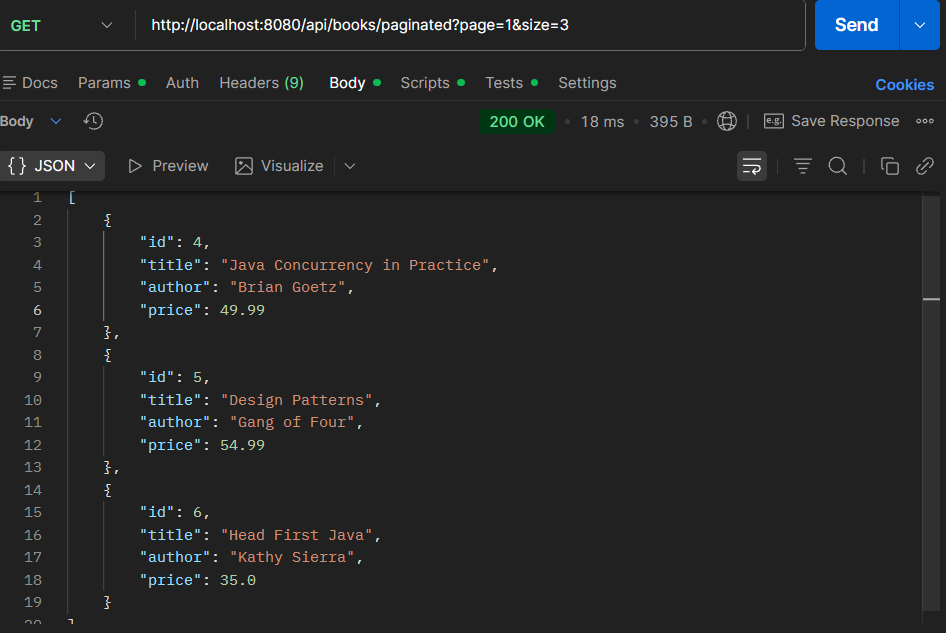

# Homework 1: Building on Books API

### Endpoints include:
* GET /api/books
* GET /api/books/{id}
* POST /api/books
* PUT /api/books/{id}
* PATCH /api/books/{id}
* DELETE /api/books/{id}
* GET /api/books/paginated?page=&size=
* GET /api/books?author=&sort=&page=&size

---
## Screenshots
### Get all books:

### Get book by id:

### Add a new book:

### Update a book at id:

### Delete a book by id:

### Get books with pagination

